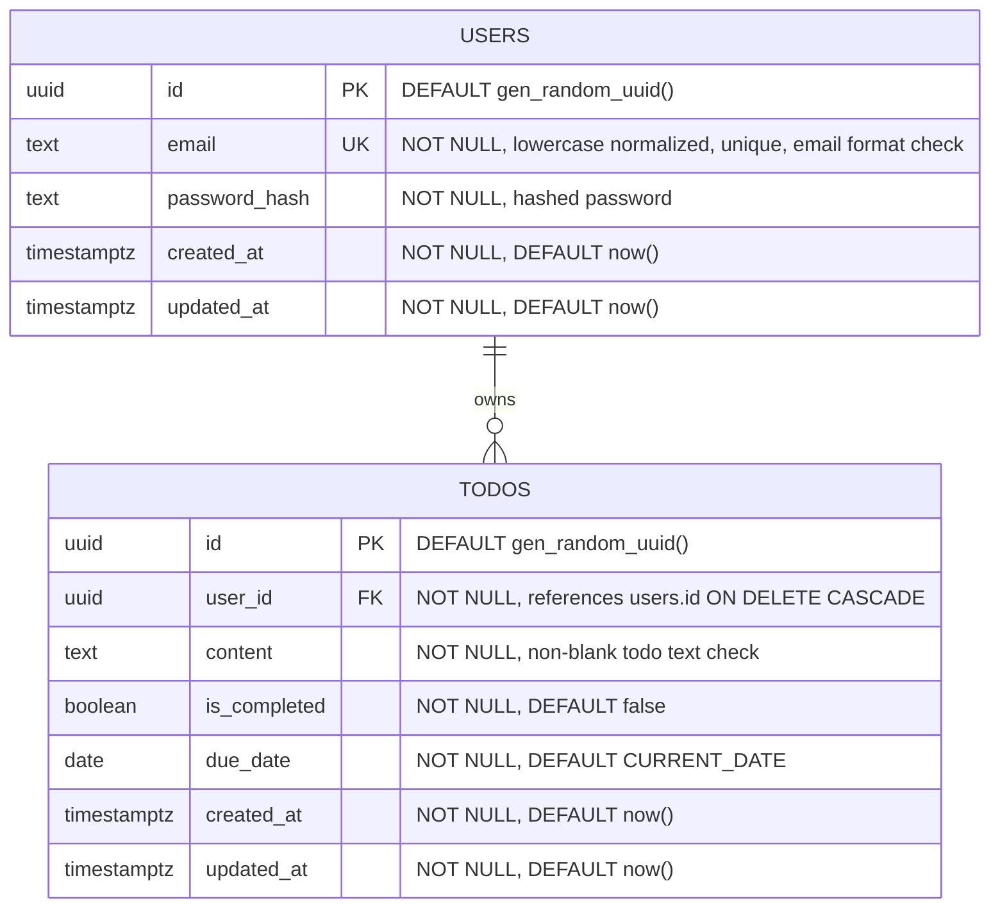

# dodoTodoList ERD

## PRD 기능 요구사항 매핑 검토 결과

| PRD 기능 | 필요한 데이터 모델 | 검토 결과 |
| --- | --- | --- |
| 회원가입 | `users.email`, `users.password_hash` | 존재함. 이메일 중복 방지와 이메일 형식 검증을 필수 제약조건으로 명시한다. |
| 로그인 | `users.email`, `users.password_hash`, `users.id` | 존재함. JWT subject로 사용할 사용자 ID가 존재하며, 비밀번호는 해시만 저장한다. |
| 할 일 추가 | `todos.user_id`, `todos.content`, `todos.is_completed` | 존재함. 공백 Todo 방지를 필수 제약조건으로 명시한다. |
| 완료 체크 | `todos.id`, `todos.user_id`, `todos.is_completed` | 존재함. `user_id`로 소유자 검증 후 완료 상태를 변경할 수 있다. |
| 할 일 삭제 | `todos.id`, `todos.user_id` | 존재함. `user_id`로 소유자 검증 후 삭제할 수 있다. |
| 전체 목록 조회 | `todos.user_id`, `todos.content`, `todos.is_completed`, `todos.due_date`, `todos.created_at` | 존재함. 사용자별 Todo 목록 조회, 월간 보기, 정렬에 필요한 컬럼이 있다. |
| 로그아웃 | 별도 테이블 없음 | 클라이언트 인증 상태 제거 방식이면 DB 테이블이 필요하지 않다. |

검토 결과, MVP 기능 구현에 필요한 추가 테이블은 없다. 다만 PRD의 입력값 검증 요구사항을 데이터베이스 레벨에서도 보장하도록 이메일 형식 검증과 공백 Todo 금지를 필수 제약조건으로 명확히 한다.

## 1. Mermaid erDiagram 코드



## 2. 각 테이블의 역할 설명

| 테이블 | 역할 |
| --- | --- |
| `users` | 자체 JWT 인증에 사용할 사용자 계정 정보를 저장한다. |
| `todos` | 사용자가 등록한 할 일의 내용, 완료 여부, 소유자 정보를 저장한다. |

## 3. 각 컬럼의 타입·제약조건·역할 설명

### `users`

| 컬럼 | 타입 | 제약조건 | 역할 |
| --- | --- | --- | --- |
| `id` | `uuid` | Primary Key, `DEFAULT gen_random_uuid()` | 사용자를 식별하는 내부 고유 ID이며 JWT subject 또는 Todo 소유자 참조에 사용한다. |
| `email` | `text` | `NOT NULL`, `UNIQUE`, 이메일 형식 검증, 소문자 정규화 저장 | 회원가입과 로그인에 사용하는 사용자 이메일이다. 이미 가입된 이메일 중복을 방지한다. |
| `password_hash` | `text` | `NOT NULL` | 평문 비밀번호 대신 안전한 해시 값을 저장한다. |
| `created_at` | `timestamptz` | `NOT NULL`, `DEFAULT now()` | 사용자 계정 생성 시각을 저장한다. |
| `updated_at` | `timestamptz` | `NOT NULL`, `DEFAULT now()` | 사용자 계정 정보의 마지막 수정 시각을 저장한다. |

필수 제약조건:

```sql
CONSTRAINT users_email_format_chk
CHECK (email ~* '^[A-Z0-9._%+-]+@[A-Z0-9.-]+\.[A-Z]{2,}$')

CONSTRAINT users_email_lowercase_chk
CHECK (email = lower(email))
```

권장 인덱스:

```sql
CREATE UNIQUE INDEX users_email_unique_idx ON users (email);
```

백엔드는 회원가입과 로그인 요청에서 이메일을 소문자로 정규화한 뒤 저장·조회해야 한다. 이렇게 하면 `text` 타입과 일반 유니크 인덱스만으로도 이메일 대소문자 중복 가입을 방지할 수 있다.

### `todos`

| 컬럼 | 타입 | 제약조건 | 역할 |
| --- | --- | --- | --- |
| `id` | `uuid` | Primary Key, `DEFAULT gen_random_uuid()` | Todo 항목을 식별하는 내부 고유 ID이다. |
| `user_id` | `uuid` | Foreign Key, `NOT NULL`, `REFERENCES users(id) ON DELETE CASCADE` | Todo를 생성한 사용자 ID이며, 사용자별 목록 조회와 권한 검증에 사용한다. |
| `content` | `text` | `NOT NULL`, 공백 제외 빈 문자열 금지 | 사용자가 입력한 할 일 내용을 저장한다. |
| `is_completed` | `boolean` | `NOT NULL`, `DEFAULT false` | Todo의 완료 여부를 저장한다. 새 Todo는 기본적으로 미완료 상태이다. |
| `due_date` | `date` | `NOT NULL`, `DEFAULT CURRENT_DATE` | Todo를 수행할 날짜를 저장하며 월간 캘린더 보기와 날짜 범위 조회에 사용한다. |
| `created_at` | `timestamptz` | `NOT NULL`, `DEFAULT now()` | Todo 생성 시각을 저장하며 목록 정렬에 사용할 수 있다. |
| `updated_at` | `timestamptz` | `NOT NULL`, `DEFAULT now()` | Todo 내용 또는 완료 상태의 마지막 수정 시각을 저장한다. |

필수 제약조건:

```sql
CONSTRAINT todos_content_not_blank_chk
CHECK (length(btrim(content)) > 0)
```

권장 인덱스:

```sql
CREATE INDEX todos_user_id_created_at_idx
ON todos (user_id, created_at DESC);

CREATE INDEX todos_user_id_is_completed_idx
ON todos (user_id, is_completed);

CREATE INDEX todos_user_id_due_date_idx
ON todos (user_id, due_date);
```

## 4. 테이블 간 관계 설명

### `users` 1 : N `todos`

- 한 명의 사용자는 여러 개의 Todo를 가질 수 있다.
- 하나의 Todo는 반드시 한 명의 사용자에게만 속한다.
- 이 관계는 PRD의 "로그인한 사용자는 자신이 등록한 모든 Todo를 볼 수 있다", "다른 사용자의 Todo 상태는 변경할 수 없다", "다른 사용자의 Todo는 삭제할 수 없다" 요구사항을 만족하기 위해 필요하다.
- 백엔드 Todo 조회, 완료 체크, 삭제 API는 항상 인증된 사용자 ID와 `todos.user_id`를 함께 조건으로 사용해야 한다.

예시:

```sql
UPDATE todos
SET is_completed = $1,
    updated_at = now()
WHERE id = $2
  AND user_id = $3;
```

`ON DELETE CASCADE`를 사용하는 이유는 사용자 계정이 삭제될 경우 해당 사용자의 Todo가 독립적인 의미를 갖지 않기 때문이다. 단, 현재 PRD에는 계정 삭제 기능이 포함되어 있지 않으므로 실제 기능 구현 시점에 정책을 재검토할 수 있다.

## 설계 범위에서 제외한 테이블

- `sessions`: PRD는 백엔드 자체 JWT 인증을 요구하지만, JWT를 짧은 만료 시간을 가진 무상태 토큰으로 운영하면 별도 세션 테이블은 필수 기능 요구사항이 아니다.
- `projects`, `tags`, `comments`, `reminders`, `collaborators`: PRD의 Out of Scope에 해당하거나 현재 핵심 기능에 필요하지 않다.
